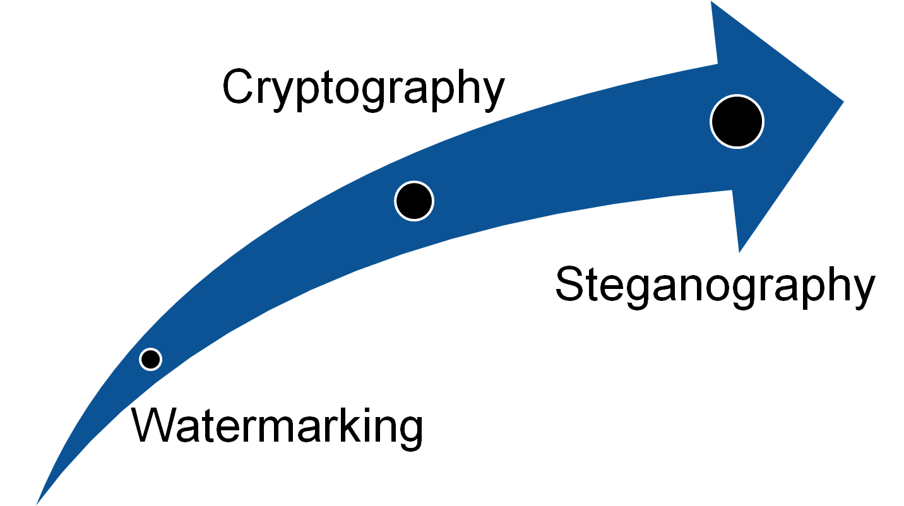

<h1 align="center"> Steganography GUI  </h1>

    
    
    
    
    
    
    
    

<!-- PROJECT LOGO -->
 

  <h3 align="center"> Steganography 📟</h3>
  

  

    A GUI Steganography Application for Windows Using C# or C++
     
    <a href="https://github.com/RabihND/AP2021-2022-Final"><strong>Explore the documents »</strong></a>
     
     
  

---

<!-- TABLE OF CONTENTS -->

  
Table of Contents
 
  <ol>
    <li><a href="#about-the-project">About The Project</a></li>
    <li><a href="#parts">Parts</a></li>
    <li><a href="#results">Results</a></li>
    <li><a href="#license">License</a></li>
    <li><a href="#refenences">Refenences</a></li>
    <li><a href="#contact">Contact</a></li>
    <li><a href="#roadmap">Roadmap</a></li>
  </ol>

<!-- ABOUT THE PROJECT -->
## About The Project

  
  

<b>Steganography</b> (/ˌstɛɡəˈnɒɡrəfi/) is the practice of concealing a message within another message or a physical object. In computing/electronic contexts, a computer file, message, image, or video is concealed within another file, message, image, or video.

(<a href="#top">back to top</a>)

### Built With

Major frameworks/libraries used in this project:

* [C#](https://en.wikipedia.org/wiki/C_Sharp_(programming_language))
* [Visual Studio 2019](https://visualstudio.microsoft.com/vs/community/)

(<a href="#top">back to top</a>)

<!-- PARTS -->
## Parts
**1. Steganography software**

 Steganography software is employed to perform a range of functions to cover data, including encoding the information in order to organize it to be hidden inside another file, keeping track of which bits of the quilt computer file contains hidden data, encrypting the info to be hidden and extracting hidden data by its intended recipient. There are proprietaries furthermore as open-source and other free-to-use programs available for doing steganography. <b><a href="https://www.openstego.com/">OpenStego</a></b> is an open-source steganography program; other programs will be characterized by the kinds of information which will be hidden still as what forms of files that data may be hidden inside. Some online steganography software tools include <b>Xiao Steganography</b>, accustomed hide secret files in BMP images or WAV files; <b>Image Steganography</b>, a Javascript tool that hides images inside other image files; and <b>Crypture</b>, a command-line tool that's wont to perform steganography.

 
**2.  What are the advantages of steganography over cryptography?** 

What are the benefits of steganography over cryptography? Steganography is distinct from cryptography, but using both together can help improve the safety of the protected information and forestall detection of the key communication. If steganographically-hidden data is additionally encrypted, the info should be safe from detection -- though the channel will not be safe from detection. There are advantages to using steganography combined with encryption over encryption-only communication. The primary advantage of using steganography to cover data over encryption is that it helps obscure the actual fact that there's sensitive data hidden within the file or other content carrying the hidden text. Whereas an encrypted file, message or network packet payload is clearly marked and identifiable intrinsically, using steganographic techniques helps to obscure the presence of the secure channel.

> Check screenshot below to see how it can be done:

Preview

  <body>
    
  </body>

**3.  How is steganography used today?** 

In modern digital steganography, data is first encrypted or obfuscated in our way and then inserted, employing a special algorithm, into data that's an element of a particular file format sort of a _JPEG image, audio,_ or _video file_. The key message is often embedded into ordinary data files in many alternative ways. 

One technique is to hide data in bits that represent the identical color pixels repeated during a row in an exceeding picture file. By applying the encrypted data to this redundant data in some inconspicuous way, the result is visiting be an image file that appears an image for the primary image but that has "noise" patterns of ordinary, unencrypted data. 
The practice of adding a watermark -- a trademark or other identifying data hidden in multimedia or other content files -- is one common use of steganography. Watermarking may be a method often utilized by online publishers to identify the source of media files that are found to be shared without permission. While there are many alternative uses of steganography, including embedding sensitive information into file types, one in all the foremost common techniques is to embed a document into an image file. When this can be often done, anyone viewing the image file mustn't be able to see a difference between the initial image file and thus the encrypted file; this can be often accomplished by storing the message with decreased bites within the record. This process could also be completed manually or with the employment of a steganography tool.

(<a href="#top">back to top</a>)

<!-- RESULTS -->
## Results

(<a href="#top">back to top</a>)

<!-- LICENSE -->
## License

Distributed under the GPL-3.0 License. See `LICENSE.txt` for more information.

(<a href="#top">back to top</a>)

<!-- REFERENCES -->
## Refenences

🔎

(<a href="#top">back to top</a>)

<!-- CONTACT -->
## Contacts

Rabih ND - [@RabihND](https://github.com/RabihND) 

**Project Link:** [https://github.com/RabihND/SteganographyGUI](https://github.com/RabihND/SteganographyGUI)

(<a href="#top">back to top</a>)

<!-- ROADMAP -->
## Roadmap

(<a href="#top">back to top</a>)

---

<b>
Maxwell-Pi Club</b>

(Organization)

